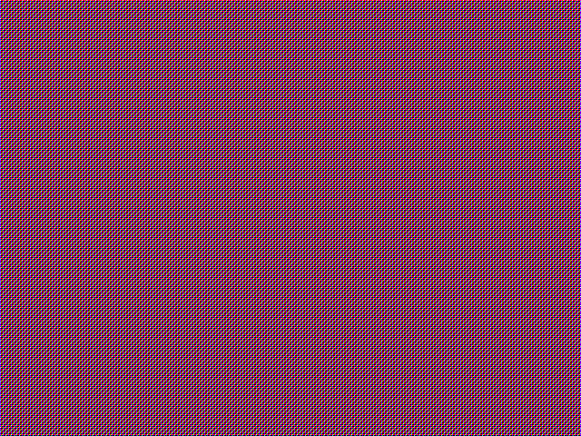

# integer-scaling
Greg Kennedy 2019

Testing ground for various integer scaling routines



## Overview
This is a C source file containing various methods for doing "nearest neighbor"
image scaling.  The goal was to test the performance of processes that copy a
source array to a destination.  Nearest neighbor algorithms will lead to a
"pixelated" look but are faster than other options like bilinear, cubic, etc.

A modern computer would simply offload this to a GPU and let it do the scaling,
but this is a CPU test.  At least, it could be placed in its own thread.

## Methods
Each method is numbered in the source.  Some methods have a letter as well:
these are "variations" of the method, which tweak some arrangement but don't
affect the overall method itself.

Each method is wrapped in a `TEST()` macro that sets up a start and end timer,
and executes the function 500 times.  The time taken for each operation is
printed to STDOUT.

Some debug functions are available: most helpful is a `dump_ppm()` which will
write a .ppm file for each method, so the results can be examined for accuracy.

A brief description of each method:

1. Straightforward division, as in:
```
    for (y = 0; y < out_height; ++y)
      for (x = 0; x < out_width; ++x)
        out[y][x] = in[y * in_to_out_ratio][x * in_to_out_ratio];
```

2. Pre-computing two tables of multiplication results
```
    /* table computation */
    ...

    for (y = 0; y < out_height; ++y)
      for (x = 0; x < out_width; ++x)
        out[y][x] = in[tbl_y[y]][tbl_x[x]];
```

3. Pre-computing one large table of multiplication results
```
    /* table computation */
    ...

    for (i = 0; i < (out_height * out_width); ++i)
      out[i] = in[tbl[i]];
```

4. Like 3., but only store when source index should advance.
```
    /* table computation */
    ...

    j = 0;
    for (i = 0; i < (out_height * out_width); ++i) {
      if (tbl[i]) ++j;
      out[i] = in[j];
    }
```

5. Fixed-point calculation of delta X and Y.
```
    dy = in_to_out_ratio;
    dx = in_to_out_ratio;

    s_y = 0;
    for (y = 0; y < out_height; ++y) {
      s_x = 0;
      for (x = 0; x < out_width; ++x) {
        out[y][x] = in[s_y][s_x];
        s_x += dx;
      }
      s_y += dy;
    }
```

Finally there's a `method_best()` which isn't actually the "best", it's a test
function for combining features of the others.

## Compilation
The `Makefile` should be simple enough to understand, though there are a number
of switchable options at the top for tweaking the `CFLAGS` of output.  These
can be useful for testing the effect of optimization levels or loop unrolling
on any of the algorithms used.
